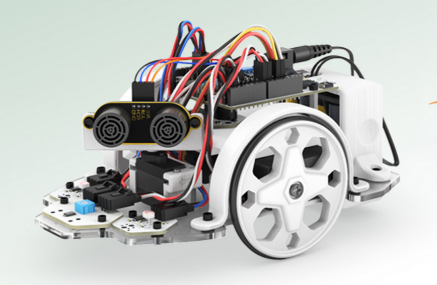

# Taller de Robótica
# Granada, Parque de Ciencias

5,6 de Marzo de 2015

Usaremos el [robot evolution](http://www.bq.com/es/printbot-evolution)

## [Robótica open-source: la robótica que te puedes llevar a casa](./TemasComunes.md)

## [Taller nivel I](./Taller_robotica_nivel_I.md)

## [Taller nivel II](./Taller_robotica_nivel_II.md)

## Referencias

[Programa Arduino - RoboPad ++](http://bitbloq.bq.com/#/codeproject/546e259ce4b0bde006d07afe:ef4e797a-61c5-4da7-850f-f1b9c56081eb)

[Sobre Robopad](
http://bitbloq.bq.com/#/project/546e259ce4b0bde006d07afe:ef4e797a-61c5-4da7-850f-f1b9c56081eb)

[Usando Robopad](http://diwo.bq.com/robopad-3/)

[Robot evolution](http://www.bq.com/es/printbot-evolution)
