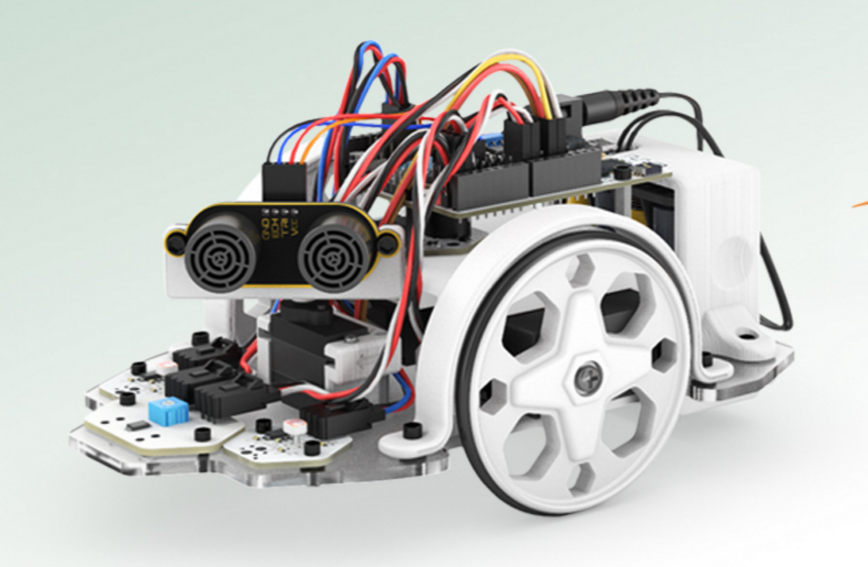
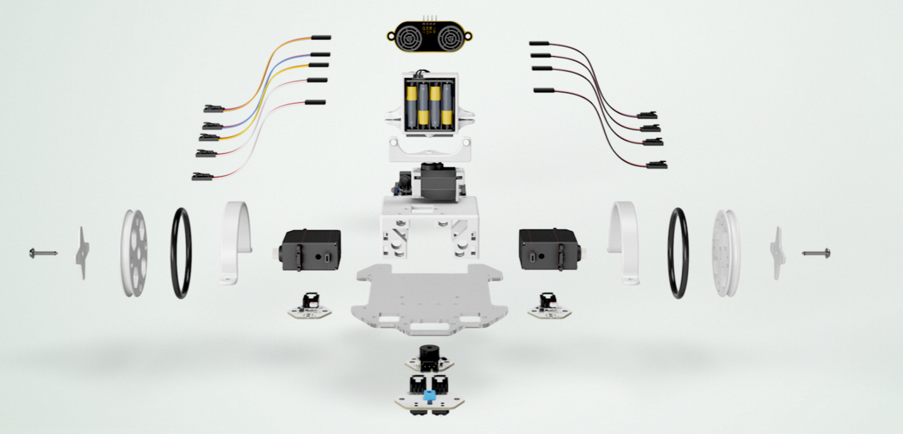
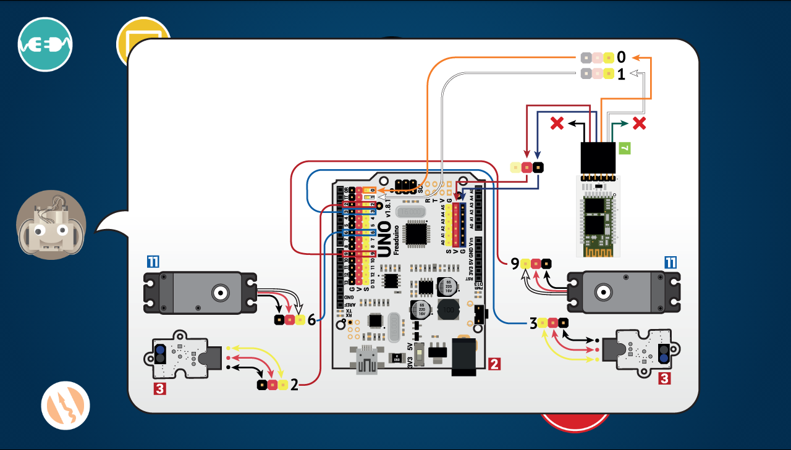
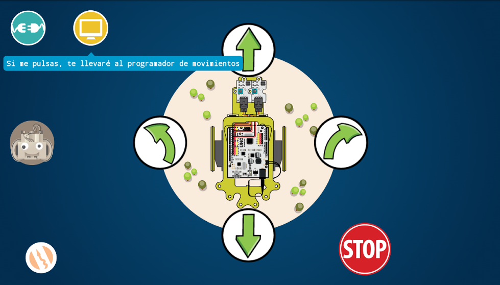
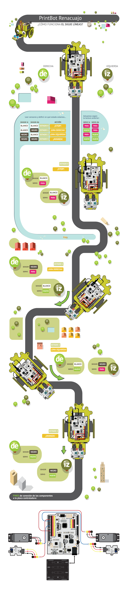
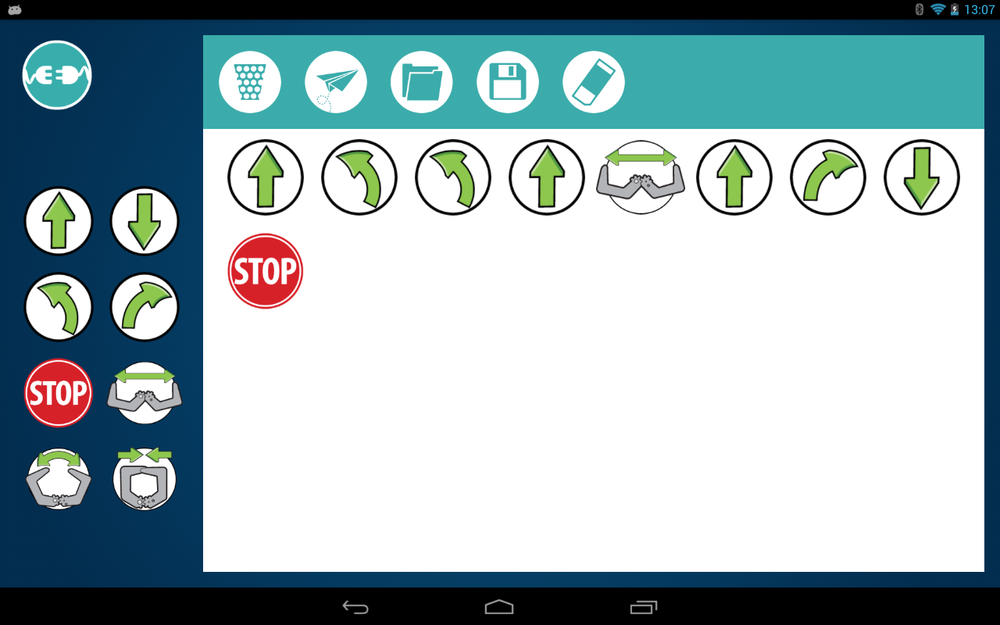

# Robótica open-source: la robótica que te puedes llevar a casa

# Taller de robótica en familia: Nivel II 11-14 años

* ¿Qué es un robot?

* Montaje de un robot: Las piezas que lo forman
  * Motores: sus músculos
  * Sensores: sus sentidos
  * Arduino: el cerebro

  

  

* Control de un robot: el software que lo controla.

* Programando un robot
    * Veremos el entorno real en el que se programa

    * Haremos programas sencillos usando el tablet

* El mundo open-source: Puedo usar, modificar y compartir los diseños y programas

## Desarrollo de la actividad

### I. Primero montamos el robot
### II. Vemos como podemos controlarlo
### III. Recorremos el circuito
### IV. Cada participante enseña su robot
