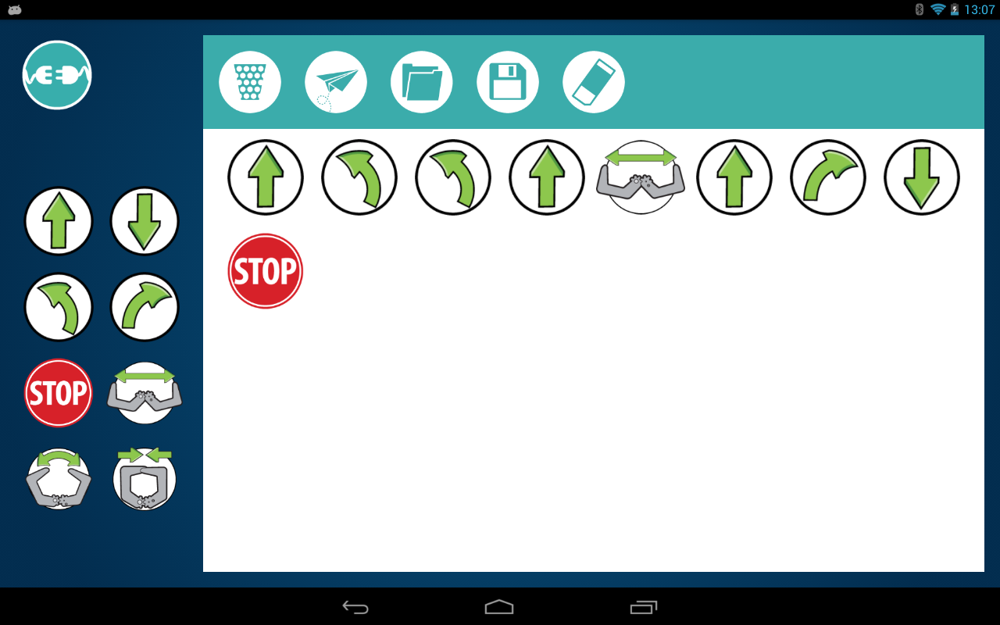

# ¿qué es un robot?

¿Kahoot?

# ¿componentes?

1. Estructura
1. Cerebro: Arduino BT-ZUM
1. Motores - Servos rotación 8 y 9 y de ángulo en 11
1. Sensores
  * Digitales: Infrarrojos 2 y 3
  * Analógicos: LDR A2 y A3
  * Inteligentes: ultrasonidos
1. Programa

Podemos usar un mismo robot con varios programas

# Usando la tablet

Tablet para controlarlo
¿cómo habla el tablet con el robot?

