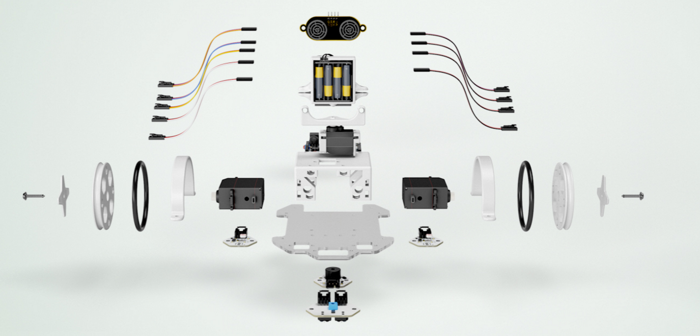
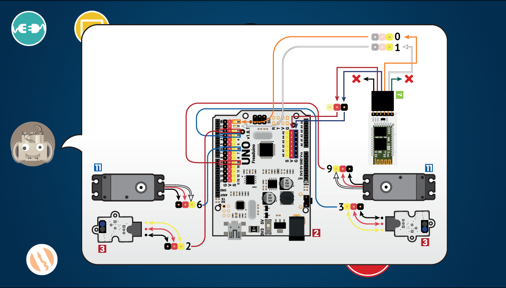

# ¿[Qué es un robot](https://create.kahoot.it/?_ga=1.26039358.2056625729.1452556026&deviceId=365ec0cb-25a2-47f5-8862-2a26ec6fe460#survey/bc3cc91c-6a19-4b4b-8dd4-621a4950a337)?

# ¿Componentes?

1. Estructura
1. Cerebro: Arduino BT-ZUM
1. Motores - Servos rotación 8 y 9 y de ángulo en 11
1. Sensores
  * Digitales: Infrarrojos 2 y 3
  * Analógicos: LDR A2 y A3
  * Inteligentes: ultrasonidos
1. Programa

Podemos usar un mismo robot con varios programas

# Montaje

[Montaje paso a paso](https://goo.gl/photos/3UE7yBEtwebcy4287)

# Usando la tablet

Tablet para controlarlo
¿cómo habla el tablet con el robot?

